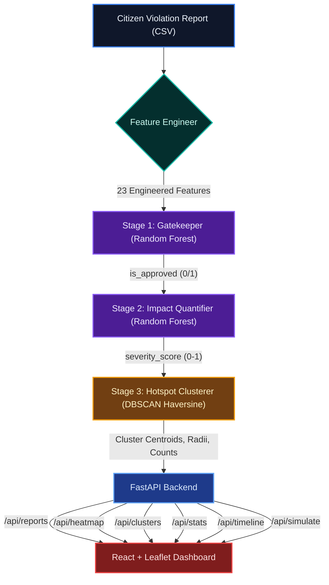

# Parking Intelligence - AI-Driven Violation Detection for Bengaluru

Bengaluru's traffic command centers receive thousands of citizen-submitted parking violation reports daily, but most are unvalidated, unscored, and spatially unorganised, making targeted enforcement nearly impossible.

Parking Intelligence solves this with a 3-stage ML cascade deployed as a full-stack application. Raw citizen reports are ingested and passed through a Gatekeeper classifier that filters out invalid submissions, an Impact Quantifier that assigns a continuous severity score (0-1), and a Hotspot Clusterer that groups nearby high-severity violations into actionable dispatch zones. The result is a real-time operations dashboard that surfaces where to send officers, ranked by impact.

## Setup & Run Instructions

### 1. Prerequisites
- Python 3.9+
- Node.js v18+

### 2. Backend Setup
Navigate to the `backend` directory and start the FastAPI server:
```bash
cd backend
pip install -r requirements.txt
```

Place the trained model `.pkl` files in `backend/models/`:
- `prod_retrain_model_m1.pkl` (Gatekeeper, ~145 MB)
- `prod_retrain_model_m2.pkl` (Impact Quantifier, ~344 MB)

If models are not present, the backend falls back to validation-status labels and heuristic severity scoring.

```bash
uvicorn app.main:app --host 0.0.0.0 --port 8000 --reload
```
The backend will run on `http://localhost:8000`. API docs are available at `http://localhost:8000/docs`.

### 3. Frontend Setup
Open a new terminal, navigate to the `frontend` directory, and start the Vite development server:
```bash
cd frontend
npm install
npm run dev
```
The dashboard will be available at `http://localhost:5173`.

## Architecture



The system operates on a 3-stage ML cascade executed at startup, with results served through a REST API:

1. **Feature Engineer**: Parses raw CSV fields into 23 model-ready features covering spatial coordinates, temporal signals (hour, day, peak/night flags), vehicle weight categories, violation type encodings, and interaction terms (e.g., heavy vehicle at peak hour, main-road violation at junction).
2. **Stage 1 - Gatekeeper (Random Forest Classifier)**: Binary classification that filters out invalid or low-quality reports, producing an `is_approved` label. Falls back to the `validation_status` column when the model is unavailable.
3. **Stage 2 - Impact Quantifier (Random Forest Regressor)**: Predicts a continuous `severity_score` (0-1) for each approved report. Falls back to a weighted heuristic combining vehicle weight, violation type severity, peak-hour multiplier, and junction proximity.
4. **Stage 3 - Hotspot Clusterer (DBSCAN)**: Groups approved, high-severity violations using haversine-distance DBSCAN (80 m eps, min 3 samples) to produce dispatch-ready cluster centroids ranked by severity x count.
5. **FastAPI Backend**: Loads models and processes all data at startup via a lifespan handler. Serves six REST endpoints consumed by the frontend.
6. **React + Leaflet Dashboard**: Renders violation markers, severity heatmaps, hotspot cluster overlays, KPI stats, an hourly timeline slider, and a live simulation panel that scores new reports through the full cascade in real-time.
