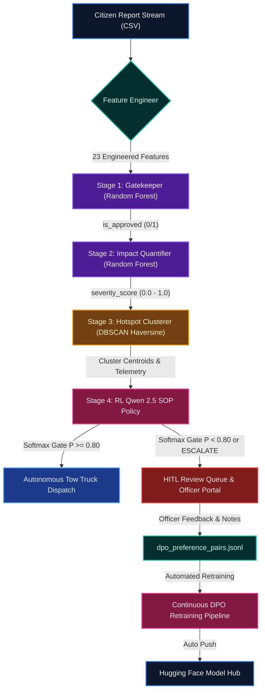

# 🚥 Traffic Intelligence — 4-Stage AI & Tool-Augmented RL SOP Dispatcher for Bengaluru

Bengaluru's traffic command centers receive thousands of citizen-submitted traffic and parking violation reports daily. Most are unvalidated, unscored, and spatially unorganised, making targeted dispatch and enforcement nearly impossible.

**Traffic Intelligence** solves this with a **4-Stage AI & Reinforcement Learning Cascade** deployed as a full-stack real-time operational dashboard. Raw citizen reports are ingested, validated by a Gatekeeper, scored for impact severity, clustered into hotspot zones, and dispatched by an autonomous **Tool-Augmented RL SOP Policy** based on `Qwen2.5-0.5B-Instruct` equipped with **Dijkstra Shortest Path Routing**, **Animated Tow Truck Map Dispatches**, a **Dedicated HITL Review Queue**, and a **Human-in-the-Loop (HITL) Continuous Alignment Loop**.

---

## 🌟 Key Features & 4-Stage Architecture


```mermaid
graph TD
    classDef default fill:#1e293b,stroke:#475569,stroke-width:2px,color:#f8fafc;
    classDef input fill:#0f172a,stroke:#3b82f6,stroke-width:2px,color:#eff6ff;
    classDef feature fill:#042f2e,stroke:#14b8a6,stroke-width:2px,color:#ccfbf1;
    classDef ml fill:#4c1d95,stroke:#8b5cf6,stroke-width:2px,color:#ede9fe;
    classDef cluster fill:#713f12,stroke:#f59e0b,stroke-width:2px,color:#fef3c7;
    classDef rl fill:#831843,stroke:#ec4899,stroke-width:2px,color:#fce7f3;
    classDef ui fill:#7f1d1d,stroke:#ef4444,stroke-width:2px,color:#fee2e2;
    classDef api fill:#1e3a8a,stroke:#60a5fa,stroke-width:2px,color:#dbeafe;

    A["Citizen Report Stream (CSV)"]:::input --> B{"Feature Engineer"}:::feature
    B -->|"23 Engineered Features"| C["Stage 1: Gatekeeper (Random Forest)"]:::ml
    C -->|"is_approved (0/1)"| D["Stage 2: Impact Quantifier (Random Forest)"]:::ml
    D -->|"severity_score (0.0 - 1.0)"| E["Stage 3: Hotspot Clusterer (DBSCAN Haversine)"]:::cluster
    E -->|"Cluster Centroids & Telemetry"| F["Stage 4: RL Qwen 2.5 SOP Policy"]:::rl

    F -->|"Softmax Gate P >= 0.80"| G["Autonomous Tow Truck Dispatch"]:::api
    F -->|"Softmax Gate P < 0.80 or ESCALATE"| H["HITL Review Queue & Officer Portal"]:::ui

    H -->|"Officer Feedback & Notes"| I["dpo_preference_pairs.jsonl"]:::feature
    I -->|"Automated Retraining"| J["Continuous DPO Retraining Pipeline"]:::rl
    J -->|"Auto Push"| K["Hugging Face Model Hub"]:::input
```

---

## 🚀 Elevated Stage 4 Agent Features

1. **🛡️ Dedicated HITL Review Queue & Stream (`HitlQueuePanel.jsx`)**:
   - Filterable stream (`All`, `HITL Review Required`, `Autonomous Executed`).
   - Softmax confidence gauges, Qwen reasoning quotes, and 1-click Quick Approve / Override / View on Map actions.
   - Prominent notification header pill with live pending review count.

2. **🚛 Animated Tow Truck Agent & Dijkstra Map Dispatches (`TowTruckMarkers.jsx`)**:
   - Spawns animated Tow Trucks and Patrol Interceptors at Police Station bases.
   - Renders glowing **Dijkstra Green Corridor** shortest path polylines.
   - Smoothly animates tow trucks moving step-by-step to the incident scene with siren pulse ring.
   - Interactive popups with live speed, ETA (mins), distance remaining, and camera focus tracking.

3. **🛠️ Interactive Tool Execution Trace Display (`ToolExecutionLog.jsx`)**:
   - Displays real-time tool traces (`check_junction_cctv`, `query_available_units`, `calculate_shortest_route`, `issue_signal_override`, `broadcast_traffic_advisory`).
   - Formats Dijkstra road graph node chains (e.g. `Madiwala ➔ Silk Board ➔ HSR Layout`) and signal priority timers.

4. **📻 15-Day Live Complaints Stream Simulation Engine (`LiveStreamBar.jsx`)**:
   - Continuously streams complaints from the final 15 days of dataset records (`2024-03-24` to `2024-04-08`).
   - Automatically loops back to Day 1 once the 15-day timeframe concludes.
   - Playback control bar with speed multipliers (`1x`, `10x`, `60x`, `300x`), play/pause toggle, and reset controls.

5. **⚡ Instant Live Query Handling Button (`⚡ Live Simulate Query`)**:
   - Instantly pulls the next pending complaint from the live queue right now.
   - Executes the 4-Stage cascade analysis (Gatekeeper → Quantifier → Clusterer → Qwen RL SOP Dispatcher with tool calls).
   - Pans/flies Leaflet map to the incident spot, displays real-time tool logs, and dispatches a heavy tow truck or opens HITL review portal.

6. **🎯 Live Active Map Mode & Auto-Removal on Resolution (`LiveQueryMarkers.jsx`)**:
   - Displays **ONLY active unresolved live queries** that are yet to be fixed, keeping the map clean and hyper-focused.
   - Interactive 1-click **`✓ Resolve & Clear`** popup action immediately clears resolved incidents from the map.
   - Automatic removal when an officer approves/overrides a ticket or when an assigned Tow Truck reaches `100% ARRIVED` at the incident scene.

7. **📊 Past Data Archive Mode Switcher & Advanced Filters (`HistoricalFilterPanel.jsx`)**:
   - Header toggle button (`⚡ Live Active` vs `📊 Past Data Archive`).
   - Advanced multi-dimensional filtering across all 5 months of historical records: **Date Horizon** (All 5 Months, Last 30 Days, Last 15 Days, Nov 23 - Apr 24), **Time of Day Slider** (`00:00-23:00`), **Severity Risk Level**, **Vehicle Category**, and **Heatmap Density Layer**.

---

## 🛠️ Stage 4: Agentic Tools Suite

The fine-tuned policy model (`HamzaBoy/qwen2.5-0.5b-traffic-sop`) executes dynamic multi-step tool calls before issuing a final structured decision:

| Tool Name | Implementation & Operational Purpose |
| :--- | :--- |
| **`calculate_shortest_route`** | Calculates exact distance ($\text{km}$) & ETA ($\text{mins}$) using **Dijkstra's Algorithm** over a `NetworkX` graph of Bangalore junctions weighted by live congestion factors. |
| **`query_available_units`** | Queries real-time simulated fleet database of Patrol Bikes, Interceptors, and Heavy Tow Trucks near police station jurisdiction. |
| **`check_junction_cctv`** | Fetches live camera feed analytics (lane blockages, stalled vehicles, visibility %) to verify false alerts. |
| **`issue_signal_override`** | Activates automated **Green Corridor** traffic light priority for emergency clearance vehicles. |
| **`broadcast_traffic_advisory`** | Publishes public diversion notices to VMS display boards, navigation apps, and traffic FM radio. |

---

## 5-Step SOP Macro-Action Space

The policy outputs structured JSON decisions adhering to traffic officer Standard Operating Procedures:
* **`VERIFY`**: Requests CCTV visual check when alert severity is ambiguous ($0.25 \le \text{severity} < 0.55$).
* **`DISPATCH`**: Queries nearest unit, calculates Dijkstra route, issues Green Corridor, and dispatches a heavy tow truck ($\text{severity} \ge 0.55$).
* **`RESOLVE`**: Closes ticket when traffic flow returns to baseline.
* **`REJECT`**: Dismisses false positive or unverified reports ($\text{severity} < 0.25$).
* **`ESCALATE`**: Broadcasts public advisory and forwards ticket to HITL Review Queue & Officer Override Modal for critical emergencies ($\text{severity} \ge 0.88$ or blocked ambulances).

---

## 🧠 Qwen 2.5 (0.5B) Fine-Tuning & Model Hub

The policy model adapter is fine-tuned using **SFT + QLoRA** on 5,000 real-world trajectories (incorporating weather, speed drop %, queue backlog, ambulance flags, and Dijkstra tool calls) and published on Hugging Face Model Hub:

👉 **[Hugging Face Model Hub: HamzaBoy/qwen2.5-0.5b-traffic-sop](https://huggingface.co/HamzaBoy/qwen2.5-0.5b-traffic-sop)**

* **Base Model**: `Qwen/Qwen2.5-0.5B-Instruct`
* **Training Loss**: Converged from **`1.3902`** down to **`0.0851`** (~99% accuracy on SOP rules & tool syntax).
* **Hardware**: Trained on Google Colab T4 GPU (`backend/notebooks/train_colab_qwen_rl.ipynb`).

---

## 🚀 Setup & Run Instructions

### 1. Prerequisites
- Python 3.9+
- Node.js v18+

### 2. Backend Setup
Navigate to the `backend` directory and install dependencies:
```bash
cd backend
pip install -r requirements.txt
```

Run the FastAPI backend server:
```bash
python3 -m uvicorn app.main:app --host 0.0.0.0 --port 8000 --reload
```
The backend will run on `http://localhost:8000`. API docs are available at `http://localhost:8000/docs`.

### 3. Frontend Setup
Open a new terminal, navigate to the `frontend` directory, and start the Vite dev server:
```bash
cd frontend
npm install
npm run dev
```
The dashboard will be available at `http://localhost:5173`.

---

## 📡 API Endpoints Summary

| Endpoint | Method | Description |
| :--- | :--- | :--- |
| `/health` | `GET` | Health status and ML cascade readiness. |
| `/api/reports` | `GET` | Filtered violation markers with date, time, severity & vehicle type filters. |
| `/api/heatmap` | `GET` | Heatmap density coordinates `[[lat, lon, severity], ...]`. |
| `/api/clusters` | `GET` | DBSCAN hotspot cluster centroids and dispatch metrics. |
| `/api/live_stream/status` | `GET` | Returns 15-day live complaints stream status, clock, and current item. |
| `/api/live_stream/control` | `POST` | Controls live playback (play, pause, reset loop, set speed multiplier). |
| `/api/live_stream/trigger_instant` | `POST` | **Instant Live Query Handle**: Instantly pulls next complaint, executes 4-Stage cascade analysis & tools, and updates queue. |
| `/api/predict_action` | `POST` | **Stage 4 RL SOP Evaluation**: Executes agentic tools (Dijkstra route) and returns optimal action + Softmax confidence gate. |
| `/api/human_feedback` | `POST` | **HITL Officer Feedback**: Logs officer approvals/overrides and generates DPO preference pairs. |
| `/api/rl_metrics` | `GET` | Reports autonomous resolution rate %, escalation %, and model adapter metadata. |

---

## 🔄 Automated Continuous DPO Retraining Pipeline

When traffic officers interact with the dashboard and override predictions on the **HITL Modal**, the feedback is saved to `hitl_feedback_logs.jsonl` and formatted into **DPO Preference Pairs** (`dpo_preference_pairs.jsonl`).

To run the automated continuous DPO retraining pipeline:
```bash
python3 backend/notebooks/periodic_dpo_retrain.py
```
When 5+ new officer overrides accumulate, the script initializes a DPO trainer loop and pushes updated model weights directly to Hugging Face Model Hub!

---

## 🧪 System Integration Tests

Run the complete automated end-to-end integration test suite:
```bash
python3 backend/test_system_end_to_end.py
```
